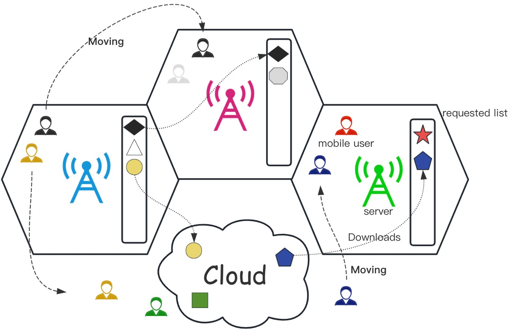
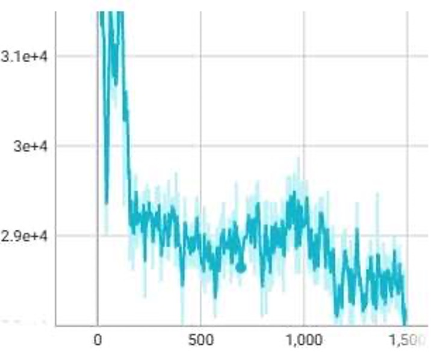
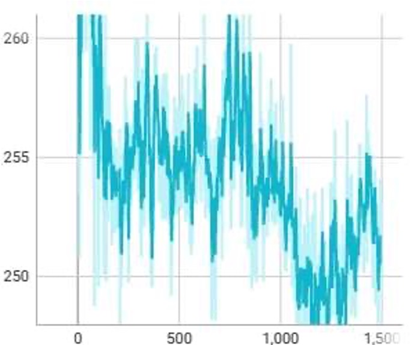
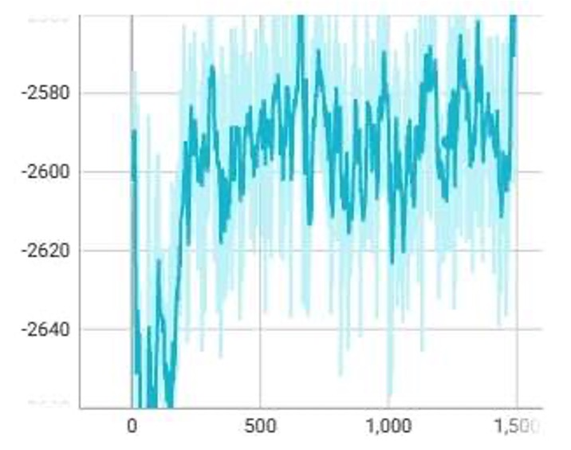
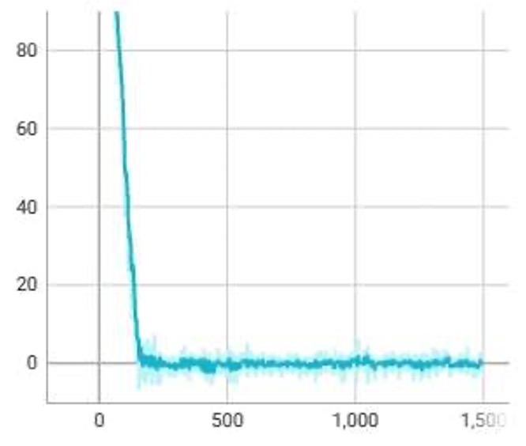

# Multi-access Edge Computing

## Intro
Reduce data transmission distance and network latency
Alleviates the network congestion problem
Save network bandwidth resources
Providing high quality of service to the devices

## Innovation
Joint task scheduling and elastic scaling based on layer sharing
Combine both active and passive scaling
Better experimental result

## Database
Based on the traffic flow, the __original data__ contains *ID, Time, Location*, __generate data__ contains *Has Task, Start Time, Has Layer, Task Arrival Time*.

## Evironment based on python
The environment contains six situations:

1. server to server
2. server to cloud
3. cloud to server
4. assigned to cloud
5. no migration

## Cost function
Considered of *transmission delay, backehaul delay, computation delay, download delay, scaling delay, migration delay, migration delay*.

## Result

